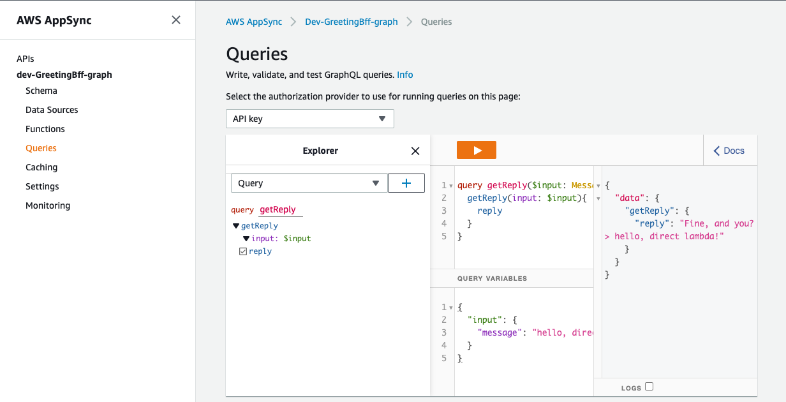

AWS Serverless application (TypeScript) project starter
===

[yarn workspace](https://classic.yarnpkg.com/en/docs/cli/workspace) based AWS CDK and Lambda Function project template. 

* Node.js (12.x)

Monorepo contains following workspaces...
---

* app-node: Lambda Function (TypeScript) 
* infra-aws: AWS CDK infra (TypeScript) 
* site-react: React SPA  


Getting Started
---

### Server

First, you should to switch aws account on your terminal app.

Using:

* https://github.com/remind101/assume-role
* https://github.com/cm-wada-yusuke/aws_swrole


and go deploy *greeting server application*:

```shell script
yarn workspace infra-aws cdk bootstrap ###first use of aws cdk, in your aws account.
yarn deploy
```

You can invoke greeting function after deploy.

```shell script
aws lambda invoke \
--payload '{"message": "Hi, how do you feel?"}' \
--function-name <greeting function arn> \
--cli-binary-format raw-in-base64-out \
out.txt
``` 


Example: 

```shell script
aws lambda invoke \
--payload '{"message": "Hi, how do you feel?"}' \
--function-name 'arn:aws:lambda:ap-northeast-1:12345667890:function:getGreetingReply-function' \
--cli-binary-format raw-in-base64-out \
out.txt

less out.txt

{"reply":"Fine, and you? > Hi, how do you feel?"}⏎
``` 


### AppSync GraphQL

You can request greeting GraphQL API via AWS Console GraphiQL.





### Test?

#### unit testing

```shell script
yarn test:unit@app
yarn test:unit@infra
```

Will testing local files.

#### E2E testing

```shell script
yarn deploy
yarn test:e2e@app
```

Will testing deployed Lambda Function invoke.


### React App

Create React App and setup apollo client. We recommend set up your React application by yourself. Following are our examples.

```shell script
# re-install packages for 'nohoist'
yarn create react-app packages/site-react --template typescript
rm -r node_modules/
rm -r packages/app-node/node_modules/
rm -r packages/infra-aws/node_modules/
rm -r yarn.lock

yarn install
```

Then, we can start react app.

```shell script
yarn workspace site-react start
```


### Rename 

Finally, rename your application.

* package.json

```diff
-  "name": "template-aws-cdk-typescript-serverless-app",
+  "name": "good-health",
  "version": "0.1.0",
```


* tsas-cdk.json

This name uses generate aws resource name, for instance, when `appName` is `greeting-service`, its Lambda Function's name: `${env}-greeting-service-${FunctionName}-function`.
 
 * `packages/infra-aws/tsas-cdk.config.json`
 * `packages/app-node/tsas-cdk.config.json`

```diff
{
-  "appName": "greeting-service",
+  "appName": "goot-health",
  "region": "ap-northeast-1"
}
```  


then, next deploy rename function to `${env}-greeting-service-${FunctionName}-function`.

